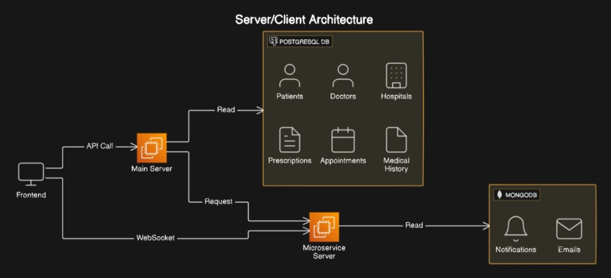

# Medicoo

## Introduction

The project is designed to transform how individuals manage their medical information, consult healthcare professionals, and handle emergency situations. It is a comprehensive platform that centralizes medical records, facilitates consultations, and provides critical emergency services.

## Features

### Centralized Medical Records
- **Storage and Tracking**: Secure storage for all medical reports, prescriptions, and medications in one place.
- **Access Control**: Users can grant viewing permissions to primary doctors, parents, or relatives, ensuring privacy and control over their medical data.

### Consultation Services
- **Doctor and Hospital Consultations**: Enables users to consult with various registered doctors and hospitals on the platform.
- **Appointment Booking**: Allows users to book appointments with doctors at available time slots or schedule offline hospital visits according to their requirements.

### Emergency Services
- **Emergency Hospital Finder**: Locates nearby hospitals based on the required specialty in case of emergencies.
- **Emergency Notifications**: Notifies the nearest hospital and the user’s parents about the emergency, sharing the user’s location.
- **Emergency Medical Data Access**: Allows emergency doctors to access the user’s medical records that are marked for emergency viewing.

### Hospital and Doctor Availability
- **Availability Tracking**: Maintains the availability of doctors and hospitals for consultations.
- **Real-time Doctor Presence**: Hospitals can track which doctors are currently present, which is crucial for managing emergencies effectively.

---

## Detailed Feature Breakdown

### Centralized Medical Records
The platform provides a centralized, secure storage solution for all medical-related information. Key functionalities include:
- **Upload and Storage**: Doctors and patients can upload and store medical reports, prescriptions, and medication details in one secure location.
- **History Tracking**: Users can maintain a comprehensive medical history, ensuring that all medical interactions and treatments are recorded.
- **Access Control**: Users can manage who has access to their medical data, including granting permissions to primary doctors, parents, or relatives. This feature ensures that sensitive information is only shared with authorized individuals, which is crucial in emergencies. Additionally, the platform allows for the organization of the entire family's medical records in one place.

### Consultation Services
The platform offers a robust system for consulting healthcare professionals:
- **Doctor and Hospital Directory**: Users have access to a comprehensive directory of registered doctors and hospitals, enabling easy search and selection.
- **Online Consultation Booking**: Users can book appointments with doctors through the platform. Available time slots are displayed, allowing users to select a convenient time for their consultation.
- **Offline Appointment Scheduling**: In addition to online consultations, users can schedule offline visits to hospitals. This flexibility ensures that users can choose the mode of consultation that best suits their needs.

### Emergency Services
In emergencies, the platform is equipped to provide rapid assistance and critical information:
- **Emergency Hospital Finder**: Utilizes geolocation technology to identify and direct users to the nearest hospital with the required specialty. This feature is crucial in time-sensitive situations.
- **Emergency Notifications**: Automatically notifies the nearest hospital and the user’s parents about the emergency. The user’s current location is included in the notification to facilitate a swift response.
- **Access to Medical Records**: During emergencies, doctors can access medical records that the user has pre-designated for emergency viewing. This ensures that healthcare providers have the necessary information to provide immediate and effective care.

### Availability Tracking
The platform ensures that users and hospitals can manage and monitor availability efficiently:
- **Consultation Availability**: Displays the current availability of doctors and hospitals for consultations, helping users to schedule appointments with ease.
- **Real-time Doctor Presence**: Hospitals can track which doctors are currently present within the facility. This feature is especially useful for managing emergencies, ensuring that the necessary medical personnel are available when needed.

## Benefits
- **Convenience**: The centralized platform simplifies the management of medical records and consultations, offering a seamless user experience.
- **Efficiency**: Quick access to medical data and emergency services significantly improves response times and treatment outcomes.
- **Safety**: The platform’s emergency features ensure that users receive timely assistance and that critical medical information is available to healthcare providers when needed.

## Conclusion
This project delivers a comprehensive solution for managing medical information, facilitating healthcare consultations, and handling emergencies. By centralizing medical data and integrating with healthcare providers, it aims to enhance overall healthcare efficiency and responsiveness.


---

<div align="center" style="display: flex; align-items: center; justify-content: center; gap: 20px;">
  
</div>

#

This project demonstrates the efficient development of a microservice using NestJS and Express.js, leveraging their respective strengths to create a scalable and maintainable application.

## NestJS  <a href="http://nestjs.com/" target="blank">  </a>
[NestJS](http://nestjs.com/) was chosen for its robustness in building scalable and maintainable server-side applications. It leverages TypeScript to provide a structured approach to writing Node.js applications, making it ideal for developing the core logic and business rules of our microservice. NestJS offers:
- **Dependency Injection**: Promotes reusability and testability of components.
- **Modular Architecture**: Facilitates organized and scalable code structure.
- **Built-in Support**: Includes support for various protocols and libraries, enhancing development speed and code quality.

## Express.js  <a href="https://nodejs.org/"></a>
[Express.js](https://expressjs.com/) complements NestJS by efficiently handling low-level HTTP functionalities and middleware management. Its minimalist and flexible nature allows fine-tuning of our microservice's routing, request handling, and response generation. Integrating Express.js with NestJS ensures seamless compatibility with existing Node.js libraries and frameworks, enabling rapid development of RESTful APIs and microservices components.

---

# **Application Security Features**

Ensuring the security of your application is crucial. This project implements several security measures to protect against common threats.

## CORS (Cross-Origin Resource Sharing)

CORS controls how resources on your server are shared with external clients, preventing unauthorized access from different origins. CORS prevents malicious websites from making unauthorized requests to your server, thereby protecting sensitive data and resources.

## CSRF (Cross-Site Request Forgery)

CSRF protection ensures that actions on a website can only be initiated by the authenticated user, preventing malicious websites from making requests on their behalf. It typically involves using tokens to validate the origin of requests and ensure they are legitimate.

## Rate Limiting (Throttling)

Rate limiting controls the number of requests a client can make to the server within a specified time frame, helping to prevent abuse and mitigate the risk of denial-of-service attacks.

## Additional Security Measures

- **Input Validation**: Validates all inputs to prevent injection attacks.
- **HTTPS**: Encrypts data in transit by using HTTPS.
- **Authentication & Authorization**: Implements robust mechanisms to ensure only authorized users can access certain resources.
- **Security Headers**: Sets appropriate HTTP security headers to prevent common web vulnerabilities.

---

## Getting Started

1. Clone the repository: 
```bash
$ git clone https://github.com/YashavantKalashetti/NestJs-Medicoo-Backend.git
```

2. Install dependencies
```bash
$ npm install
```

3. Database Migrations
```bash
$ npx prisma migrate dev | npm prisma:dev:deploy
```

## Running the app

```bash
# development
$ npm run start

# watch mode
$ npm run start:dev
```

To start the MicroService_Server(Helper Server) in development mode, navigate to the [``Microservice-Server``](https://github.com/YashavantKalashetti/NestJs-Medicoo-Backend/tree/main/Microservice-Server) directory and run:

```bash
$ npm install
$ node index.js 
```

**Note:** Properly configure .env file and change database(PostgreSQL, 

MongoDB) links, Redis link, Cloudinary link and Stripe(Payment links) and Elastic Search API Link.

---

## License
[MIT](LICENSE)

---

## Contact
For more information, please contact [Yashavant Kalashetti](mailto:yashwantkalashetti44@gmail.com).
